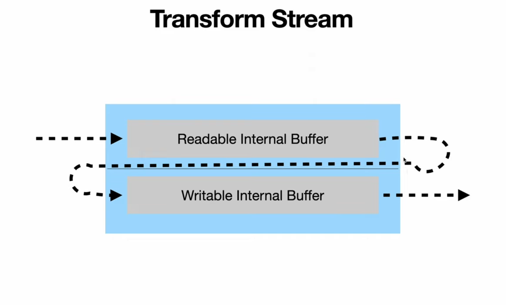

# Transform Stream #

- A Transform stream is a special type of Duplex stream where the output is computed in some way from the input. Examples include zlib streams, crypto streams, encoding/decoding etc. that compress, encrypt, or decrypt data.
- If you just pass data from one stream to another stream and don't do anything in b/w, it is called **PassThrough Stream** (it is  trivial implementation of Transform Stream).
- There is no requirement that the output be the same size as the input, the same number of chunks, or arrive at the same time. For example, a Hash stream will only ever have a single chunk of output which is provided when the input is ended. A zlib stream will produce output that is either much smaller(compress) or much larger(decompress) than its input.
- The **Transform** class is extended to implement a Transform stream.
- The **Transform** class prototypically inherits from **Duplex** and implements its own versions of the **writable._write()** and **readable._read()** methods. Custom Transform implementations must implement the **transform._transform()** method and may also implement the **transform._flush()** method.

- **Care must be taken when using Transform streams in that data written to the stream can cause the Writable side of the stream to become paused if the output on the Readable side is not consumed.**



```javascript
import { Transform } from "stream";
import { open } from "fs/promises";
import { log } from "console";
import { createGunzip } from "zlib";

const transformStream = new Transform({
    transform(chunk, encoding, callback) {
        // Do some transformation of input stream
        log(chunk.toString("utf-8"));
        callback(null, chunk);
    }

    
});


(async () => {
  const fileHandlerRead = await open("./dest_doc.md", "r");
  const fileHandlerWrite = await open("doc_final_dest.md", "w");
  const readStream = fileHandlerRead.createReadStream();
  const writeStream = fileHandlerWrite.createWriteStream();
  //   readStream.pipe(crypto).pipe(writeStream);
  readStream
    .pipe(createGunzip({ level: 2 }))
    .pipe(transformStream)
    .pipe(writeStream);
})();
```

- **_transform(chunk, enc, cb)** - reading chunks and pushing your transformed data
- **_flush(cb)** - if you need to write additional data at the end after input is finished
  